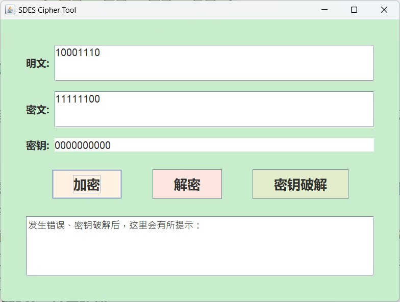

# SDES
本项目是一次信息安全导论实验，根据简单的加解密算法SDES进行设计，详情请见石墨文档[SDES](https://shimo.im/docs/m5kvdlMaKvcENy3X/read)。
## 简单的加解密模块
[SDES.java](test/src/SDES.java)：该文件中定义并实现了SDES算法的加密、解密功能
## 暴力破解SDES
[BruteForceSDES.java](test/src/BruteForceSDES.java)：该文件中定义并实现了针对SDES算法的暴力破解密钥功能
## GUI设计
[mainForm.java](test/src/mainForm.java)：该文件中定义并实现了用户界面，便于进行加解密以及暴力破解
## 过关测试结果
### 第1关：基本测试
该项目根据S-DES算法编写和调试程序，提供GUI解密支持用户交互。输入可以是8bit的数据和10bit的密钥，输出是8bit的密文。

### 第2关：交叉测试
测试图片/)K74NOX({)YV(70NI~05EX4.jpg

### 第3关：扩展功能

### 第4关：暴力破解

### 第5关：封闭测试

## 用户指南

