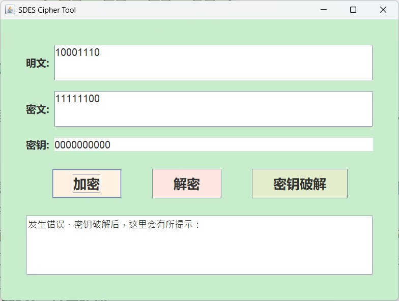
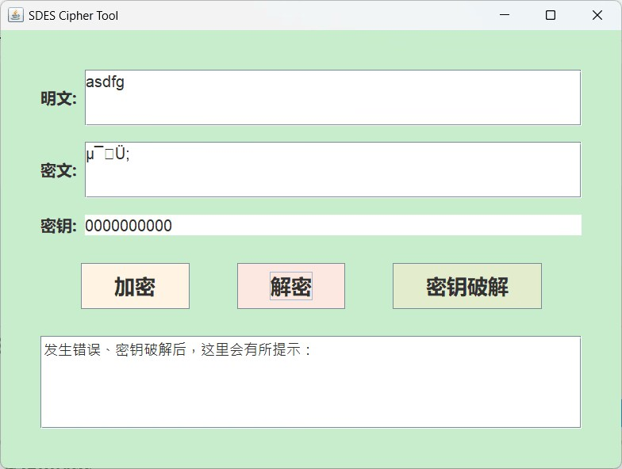
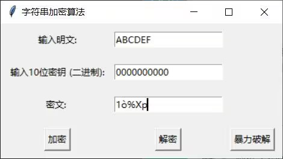
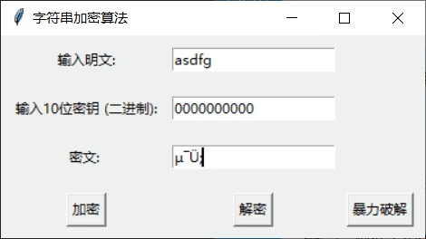
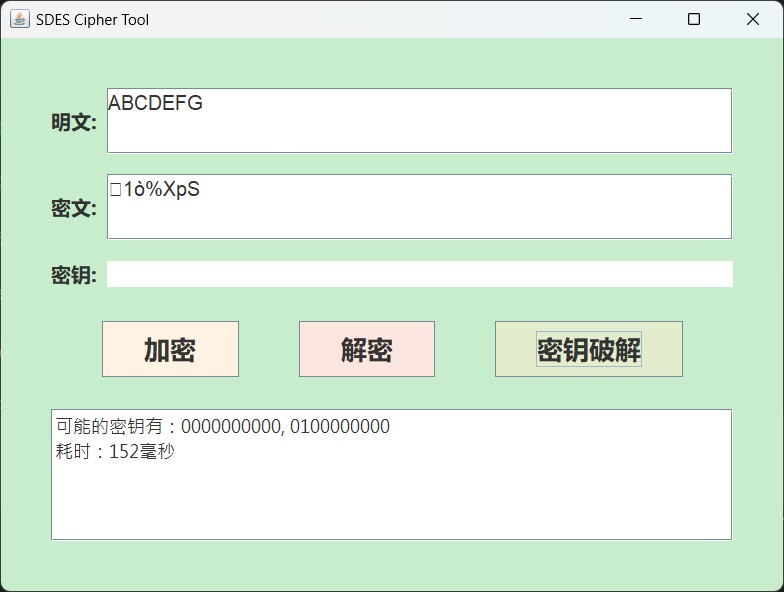

# SDES
本项目是一次信息安全导论实验，根据简单的加解密算法SDES进行设计，详情请见石墨文档[SDES](https://shimo.im/docs/m5kvdlMaKvcENy3X/read)。
## 简单的加解密模块
[SDES.java](test/src/SDES.java)：该文件中定义并实现了SDES算法的加密、解密功能
## 暴力破解SDES
[BruteForceSDES.java](test/src/BruteForceSDES.java)：该文件中定义并实现了针对SDES算法的暴力破解密钥功能
## GUI设计
[mainForm.java](test/src/mainForm.java)：该文件中定义并实现了用户界面，便于进行加解密以及暴力破解
## 过关测试结果
### 第1关：基本测试
该项目根据S-DES算法编写和调试程序，提供GUI解密支持用户交互。输入可以是8bit的数据和10bit的密钥，输出是8bit的密文。

### 第2关：交叉测试
考虑到SDES是算法标准，所有人在编写程序的时候需要使用相同算法流程和转换单元(P-Box、S-Box等)，以保证算法和程序在异构的系统或平台上都可以正常运行。我们寻找到了另外一个小组进行交叉加解密测试。

### 第3关：扩展功能
考虑到向实用性扩展，加密算法的数据输入可以是ASII编码字符串(分组为1 Byte)，对应地输出也可以是ACII字符串(很可能是乱码)。展示效果可见第2关测试。
### 第4关：暴力破解
当找到了使用相同密钥的明、密文对(一个或多个)，可以尝试使用暴力破解的方法找到正确的密钥Key。

### 第5关：封闭测试
根据第4关的结果，进一步分析，对于随机选择的一个明密文对，有不止一个密钥Key。进一步扩展，对应明文空间任意给定的明文分组P{n}，会出现选择不同的密钥K_{i}\ne K_{j}加密得到相同密文C_n的情况？
## 用户指南

